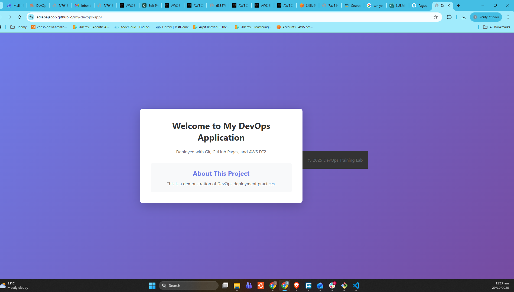
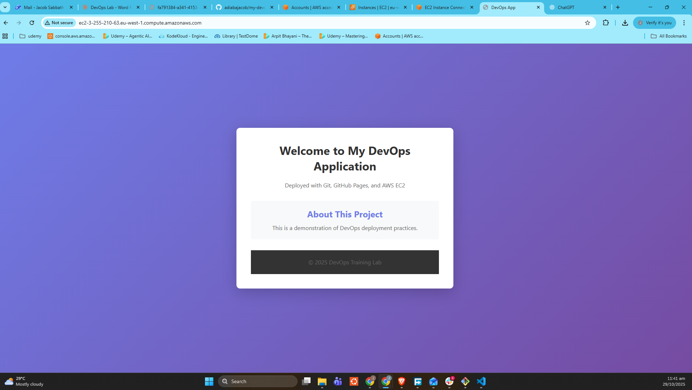
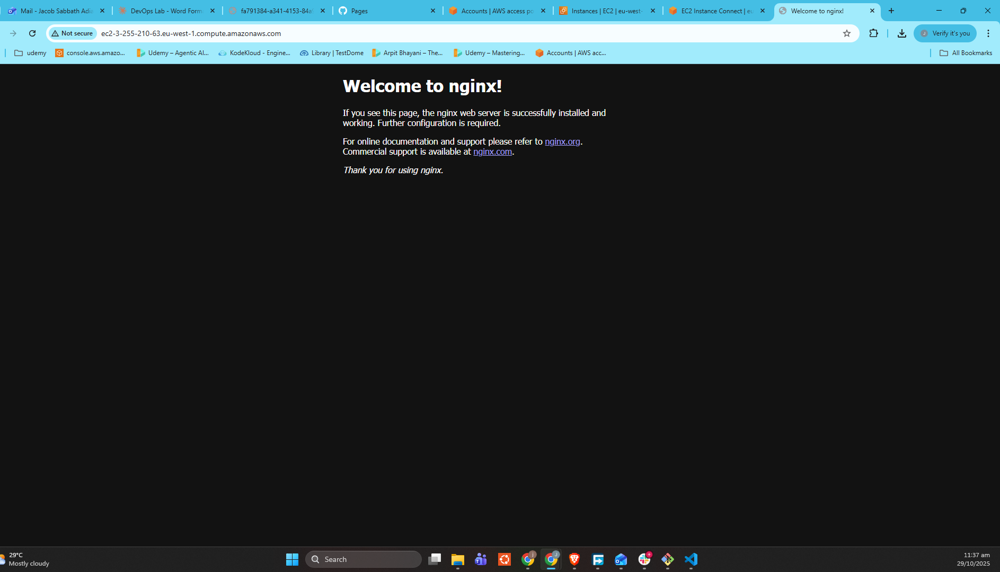

# My DevOps Application 🚀

A modern static web application demonstrating comprehensive DevOps practices including version control with Git, automated CI/CD deployments, cloud hosting on AWS EC2, and web server configuration with Nginx.

## 📋 Project Overview

This project showcases a complete DevOps workflow from development to production deployment. It features a responsive static website built with HTML5, CSS3, and modern web standards, deployed using automated GitHub Actions workflows to multiple environments including GitHub Pages and AWS EC2.

### 🎯 Key Features

- **Responsive Design**: Mobile-first approach with modern CSS Grid and Flexbox
- **Modern Styling**: Gradient backgrounds, smooth transitions, and professional typography
- **Automated Deployment**: GitHub Actions CI/CD pipeline for seamless deployments
- **Multi-Environment Support**: Deployments to both GitHub Pages and AWS EC2
- **Production-Ready**: Nginx web server configuration with proper security practices
- **Infrastructure as Code**: Automated server configuration and deployment scripts

## 🏗️ Architecture

```
┌─────────────────┐    ┌──────────────────┐    ┌─────────────────┐
│   Developer     │    │   GitHub Actions │    │   AWS EC2       │
│   Local Dev     │───▶│   CI/CD Pipeline │───▶│   + Nginx       │
│                 │    │                  │    │                 │
└─────────────────┘    └──────────────────┘    └─────────────────┘
                              │
                              ▼
                       ┌──────────────────┐
                       │  GitHub Pages    │
                       │  Static Hosting  │
                       │                  │
                       └──────────────────┘
```

## 🛠️ Technology Stack

### Frontend

- **HTML5**: Semantic markup with modern web standards
- **CSS3**: Advanced styling with gradients, flexbox, and responsive design
- **Responsive Design**: Mobile-first approach for optimal user experience

### DevOps & Infrastructure

- **Version Control**: Git with GitHub for source code management
- **CI/CD**: GitHub Actions for automated testing and deployment
- **Cloud Platform**: Amazon Web Services (AWS)
- **Web Server**: Nginx for high-performance static file serving
- **Operating System**: Ubuntu Linux on AWS EC2
- **Automation**: Shell scripting for deployment automation

### Development Tools

- **Code Editor**: VS Code with extensions for web development
- **Terminal**: Bash for command-line operations
- **Package Management**: Git for dependency and version management

## 📸 Project Screenshots

### 1. Initial GitHub Pages Deployment


_The application successfully deployed to GitHub Pages, demonstrating the initial hosting setup and responsive design._

### 2. AWS EC2 Production Deployment


_Production deployment running on AWS EC2 instance, showing the complete DevOps pipeline in action._

### 3. Nginx Server Configuration


_Nginx web server properly configured and serving the application on AWS EC2 infrastructure._

## 🚀 Deployment Pipeline

### GitHub Actions Workflow

The project implements a comprehensive CI/CD pipeline that automatically:

1. **Code Checkout**: Retrieves the latest code from the main branch
2. **SSH Configuration**: Sets up secure connection to AWS EC2 instance
3. **File Transfer**: Copies application files to the production server
4. **Server Configuration**:
   - Creates backup of existing deployment
   - Updates file permissions for security
   - Configures Nginx web server
5. **Service Management**: Reloads Nginx and ensures service availability
6. **Deployment Verification**: Validates successful deployment with HTTP checks

### Deployment Environments

#### GitHub Pages

- **URL**: Automatically generated GitHub Pages URL
- **Purpose**: Development and staging environment
- **Deployment**: Automatic on push to main branch
- **Features**: SSL/HTTPS enabled by default

#### AWS EC2 Production

- **Infrastructure**: Ubuntu server on AWS EC2
- **Web Server**: Nginx for high-performance serving
- **Security**: SSH key-based authentication
- **Monitoring**: Automated health checks and verification
- **Backup**: Automatic backup creation before deployments

## 📁 Project Structure

```
my-devops-app/
├── .github/
│   └── workflows/
│       └── deploy-to-ec2.yml     # GitHub Actions CI/CD pipeline
├── index.html                    # Main application page
├── styles.css                   # Application styling
├── README.md                    # Project documentation
├── DEPLOYMENT_GUIDE.md          # Deployment setup instructions
└── screenshots/                 # Project documentation images
    ├── initial_site_hosted_on_githubpages.png
    ├── deployed_to_ec2.png
    └── nginx_homepage_on_ec2.png
```

## 🔧 Local Development Setup

### Prerequisites

- Git installed on your local machine
- Text editor (VS Code recommended)
- Terminal/Command prompt access
- Basic knowledge of HTML, CSS, and command line

### Getting Started

1. **Clone the Repository**

   ```bash
   git clone https://github.com/adiabajacob/my-devops-app.git
   cd my-devops-app
   ```

2. **Open in Development Environment**

   ```bash
   # Open with VS Code
   code .

   # Or open index.html in your browser
   open index.html  # macOS
   start index.html # Windows
   ```

3. **Make Changes**

   - Edit `index.html` for content changes
   - Modify `styles.css` for styling updates
   - Test changes locally in your browser

4. **Deploy Changes**
   ```bash
   git add .
   git commit -m "Your descriptive commit message"
   git push origin main
   ```

## 🌐 Live Deployments

- **GitHub Pages**: [View Live Site](https://adiabajacob.github.io/my-devops-app/)
- **AWS EC2 Production**: Available at configured EC2 public IP address

## 🛡️ Security Considerations

### Production Security

- SSH key-based authentication for EC2 access
- GitHub Secrets for sensitive configuration data
- Nginx security headers and configurations
- Regular security updates and patches

### Best Practices Implemented

- No hardcoded credentials in source code
- Secure file permissions (755 for directories, 644 for files)
- Automated backup creation before deployments
- Health checks and rollback procedures

## 📊 Performance Optimizations

- **Static File Serving**: Nginx optimized for static content delivery
- **Responsive Images**: Optimized image sizes for different devices
- **CSS Optimization**: Efficient selectors and minimal redundancy
- **Caching Strategy**: Browser caching enabled through Nginx configuration

## 🔍 Monitoring & Maintenance

### Automated Checks

- Deployment verification with HTTP status code validation
- Nginx configuration testing before service reload
- Automatic service restart procedures

### Manual Monitoring

- Server resource usage (CPU, memory, disk)
- Application logs review
- Security updates and patch management

## 🤝 Contributing

Contributions are welcome! Please follow these steps:

1. Fork the repository
2. Create a feature branch (`git checkout -b feature/amazing-feature`)
3. Commit your changes (`git commit -m 'Add amazing feature'`)
4. Push to the branch (`git push origin feature/amazing-feature`)
5. Open a Pull Request

### Development Guidelines

- Follow semantic HTML practices
- Maintain responsive design principles
- Test on multiple browsers and devices
- Update documentation for significant changes

## 📚 Learning Resources

This project demonstrates concepts from:

- **DevOps Fundamentals**: CI/CD, Infrastructure as Code
- **Cloud Computing**: AWS services, server management
- **Web Development**: HTML5, CSS3, responsive design
- **System Administration**: Linux, Nginx, security practices
- **Version Control**: Git workflows, branching strategies

## 🐛 Troubleshooting

### Common Issues

#### Deployment Failures

- Check GitHub Secrets configuration
- Verify EC2 instance accessibility
- Review GitHub Actions logs

#### Nginx Issues

- Validate configuration: `sudo nginx -t`
- Check service status: `sudo systemctl status nginx`
- Review error logs: `sudo tail -f /var/log/nginx/error.log`

#### SSH Connection Problems

- Verify SSH key permissions
- Check security group settings
- Confirm correct username for EC2 instance type

## 📄 License

This project is licensed under the MIT License - see the [LICENSE](LICENSE) file for details.

## 👨‍💻 Author

**Jacob Sabbath Adiaba**

- GitHub: [@adiabajacob](https://github.com/adiabajacob)
- Project: [my-devops-app](https://github.com/adiabajacob/my-devops-app)

## 🙏 Acknowledgments

- AmaliTech gGmbH DevOps Training Program
- AWS Documentation and Best Practices
- GitHub Actions Community
- Nginx Community Documentation

---

⭐ **Star this repository if you found it helpful!** ⭐

_This project is part of the AmaliTech DevOps upskilling program, demonstrating practical implementation of modern DevOps practices and cloud deployment strategies._
